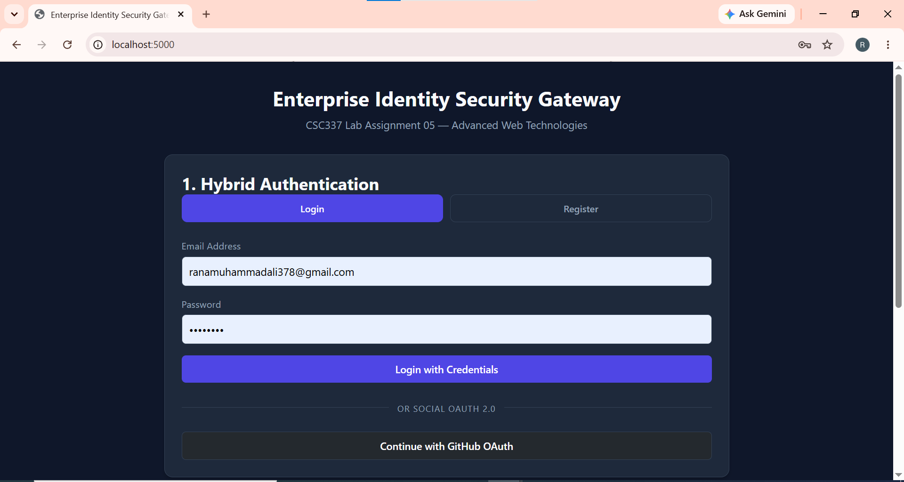
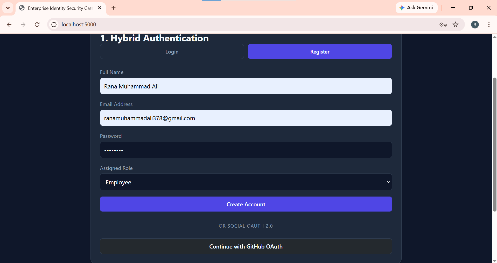
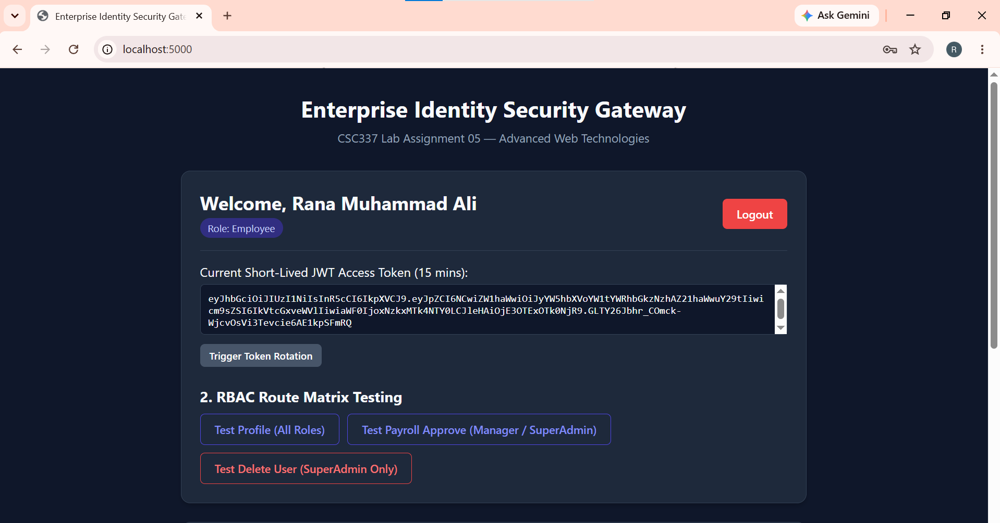

# 🛡️ Enterprise Identity Security Gateway
> Production-Ready Identity & Access Management (IAM) Gateway built with Zero-Trust principles and OWASP Top 10 hardening.

---

### 👨‍💻 Engineering & Architecture
* **Author / Lead Developer:** Rana Muhammad Ali
* **Architecture Pattern:** Dual-Token Rotating Claims & Distributed RBAC
* **Target Environment:** Multi-Tenant Enterprise Microservices

---

## 📌 Architectural Overview
An enterprise-grade Identity and Access Management Gateway designed to mitigate unauthorized data access, credential stuffing, and session hijacking. Built with Node.js, Express, and Serverless PostgreSQL (Neon.tech), this gateway implements dual-token cryptographic lifecycle management (Access/Refresh rotation), Social OAuth 2.0 federation, granular hierarchical Role-Based Access Control (RBAC), and strict HTTP header hardening.

---

## 📸 System Architecture & Visual Proofs

### 1. Unified Hybrid Authentication Portal
Consolidated gateway supporting secure credential login, salted cryptographic password verification, and social OAuth 2.0 integration.

<p align="center">
  
</p>

---

### 2. Multi-Tenant User Provisioning & RBAC Role Binding
Secure registration portal enforcing password complexity rules and assigning granular system roles (`Employee`, `Manager`, `SuperAdmin`).

<p align="center">
  
</p>

---

### 3. Active Security Gateway & Cryptographic Token Rotation
Authenticated control center showcasing dynamic short-lived JWT access token decoding, automatic rotation triggers, and route-level authorization matrices.

<p align="center">
  
</p>

---

## 🔐 Core Security Implementations

* **Cryptographic Defense:** Passwords salted and hashed via Bcrypt (Cost Factor 10) to mitigate offline dictionary and rainbow table exploits.
* **Dual-Token Rotation Lifecycle:**
  * **Access Token:** Short-lived (15 minutes), signed via HMAC-SHA256, transmitted through `Authorization: Bearer <token>` headers.
  * **Refresh Token:** Cryptographically signed, stored in database with family-tracking to prevent reuse attacks, delivered strictly via `httpOnly`, `SameSite=Strict`, `Secure` cookies.
* **Hierarchical RBAC Enforcement:** Middleware pipeline verifying cryptographic signatures and enforcing strict permission boundaries across Employee, Manager, and SuperAdmin endpoints.
* **OWASP Hardening & Attack Mitigation:**
  * **Helmet Integration:** Enforces Content Security Policy (`CSP`), HSTS, and MIME sniffing protection.
  * **Brute-Force & DoS Mitigation:** IP-based rate limiting on sensitive authentication pathways.
  * **CORS Controls:** Whitelisted origin validation preventing unauthorized cross-origin data exposure.

---

## 🛠️ Technology Stack
* **Backend Runtime:** Node.js (v18+)
* **Application Framework:** Express.js
* **Relational Database:** PostgreSQL (Neon Serverless Cloud)
* **Identity Provider:** GitHub OAuth 2.0 / OpenID Connect
* **Deployment Platform:** Render (PaaS)

---

## ⚙️ Local Development Setup

1. **Clone the Repository:**
   ```bash
   git clone [https://github.com/ranamuhammadali378-sys/enterprise-identity-security-gateway.git](https://github.com/ranamuhammadali378-sys/enterprise-identity-security-gateway.git)
   cd enterprise-identity-security-gateway
